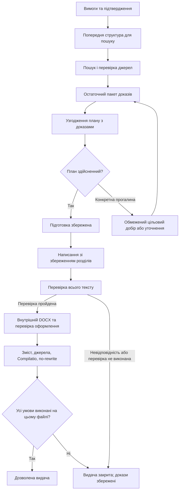

# Контракт виробничого процесу — пропозиція

Статус: PROPOSED. Не новий затверджений роадмап. Обсяг: внутрішнє виробництво першої прийнятої роботи та відновлення після збою; CRM, продажі й доопрацювання готової роботи за клієнтськими зауваженнями поза цим проєктом.

Після незалежного рев'ю Fable/Grok перша реалізація обмежена підготовкою й відновленням та набором T01–T10. Решта цього документа описує цілісний контракт і подальші залежності, а не список обов'язкових нових модулів до першого контролю. За розбіжності щодо першого обсягу застосовується [REVIEW_DECISIONS.md](REVIEW_DECISIONS.md).

Подальший [план виконання](../../plans/THESICA-STABILITY-EXECUTION.md) закриває вибір manual resume: той самий job, append-only журнал і bounded grant за новим ідемпотентним наміром. Це уточнення замінює попередній linked-job варіант у §5 нижче; воно не є реалізацією.

## 1. Продуктовий результат

Менеджер вводить вимоги, перевіряє видимі припущення й підтверджує запуск. Система самостійно знаходить докази, узгоджує план, пише, перевіряє та зберігає внутрішній DOCX. Менеджер оцінює зміст і вносить Compilatio. Дозвіл на видачу належить точному перевіреному файлу.

Підтриманий початковий набір визначається чинними AGENT_SYNC/THESICA-PLAN, а не довільним припущенням генератора. Тип роботи, академічний рівень, мова, метод, обсяг, структура й формат цитування мають бути явними. Непідтриманий емпіричний компонент без даних не можна непомітно замінити оглядом. Відсутність методички або готових PDF сама по собі не є причиною відмови.

Не потрібна нова обов'язкова кнопка між пошуком і написанням. Внутрішній стан «підготовка готова» корисний для відновлення. Додаткове рішення менеджера потрібне лише коли змінюються погоджене завдання або істотні припущення. Витратний пошук також запускається лише в межах чинного підтвердження; слово «підготовка» не робить AI-виклик безкоштовним.

## 2. Послідовність і збережені результати



Петля цільового добору має ліміт; вона не означає повторення до випадкового PASS. Після зміни пакета повторно перевіряються залежні прив'язки. Коли вже є текст, змінений пакет створює іншу версію залежних результатів або явно робить їх нечинними; не можна продовжити старий текст із непомітно заміненими доказами.

Для класу №8 спочатку узгоджується план з уже отриманими джерелами. Старий ключ не є причиною нового пошуку. Лише встановлена змістовна прогалина відкриває обмежений добір. Число джерел не доводить покриття конкретної вимоги.

| Етап | Вхід | Збережений вихід і умова завершення |
|---|---|---|
| Контракт | Вимоги, допустимі припущення, опціональні файли, підтвердження | Хеш незмінного завдання та підтриманий профіль; створення чернетки не запускає написання |
| Джерела | Завдання і попередній план пошуку | Нормалізовані джерела, точний доступний текст/уривки, походження, причини відхилення; не тільки кількість або DOI |
| Готовність плану | Остаточні докази та затверджені вимоги | Реальні прив'язки до джерел; покриття академічних функцій; окремо невиконані вимоги й допустимі обмеження; збережений результат перевірки |
| Написання | Точний підготовлений пакет, чинний профіль писаря | Завершені секції з входами/версією; незавершена відповідь не вважається готовою секцією |
| Перевірка тексту | Весь чинний текст і джерела | Результат на конкретному хеші; невиконана перевірка не еквівалентна PASS; обмеження контексту видиме |
| Експорт | Чинний текст, структура й шаблон | Відкриваний DOCX, його хеш, відсутність втрат змісту/цитат, перевірені сторінки й оформлення |
| Приймання | Той самий DOCX | Результати Compilatio, приймання змісту/джерел і no-rewrite; зміна байтів скасовує застосовність попереднього приймання |
| Видача | Чинні докази та права доступу | Авторизований доступ саме до дозволеної версії; старе посилання не обходить поточний стан |

Це логічні межі. Вони не вимагають окремого сервісу чи таблиці для кожного рядка. Почати з невеликих функцій/об'єктів результату всередині наявного виконавця й використовувати існуючі jobs, sections, provenance та review records. Розділення головної функції робити під потрібні сценарії, а не як загальне косметичне переписування.

## 3. Інваріанти

1. Один намір запуску має не більше однієї чинної задачі. Повтор HTTP-запиту не означає нову виробничу спробу.
2. Писати результат може лише чинний власник lease. Запізніла відповідь після скасування або передачі задачі не відновлює її.
3. Чинний підтверджений прогрес не очищається через тимчасовий збій, повтор перевірки або втрату відповіді браузеру.
4. Збережений результат придатний лише для тих вхідних даних, джерел і профілю, на яких отриманий. Хеш доводить тотожність, але не істинність змісту.
5. Число повторів обмежене й обліковується на рівні логічної операції, включно з вкладеними SDK-повторами. Постійна помилка або невиконана вимога не запускає нескінченне написання.
6. Звичайне обмеження методу не є аварією. Невиконана істотна вимога не перетворюється на попередження для отримання зеленого статусу.
7. Внутрішній файл, успіх виконання та дозвіл на видачу — різні факти. Видимість внутрішнього DOCX авторизованому менеджеру не означає клієнтську готовність.
8. Приймання прив'язане до точних байтів; будь-яка зміна скасовує його застосовність до нової версії.
9. Задача не висить безстроково без heartbeat/progress та видимої причини; невідомий збій зберігає діагностику і контрольну точку.
10. Історія спроб, ручних втручань і підтверджених/невідомих витрат не стирається успішним повтором. Токени за відповідями застосунку не оголошуються точним рахунком провайдера.
11. Читання й відновлення не порушують доступи, видалення облікового запису та ізоляцію справ.
12. Новий реліз не повинен непомітно продовжувати задачу за несумісними правилами. За відсутності доведеної сумісності — завершення активних задач до перемикання або явна збережена пауза.

## 4. Стани, причини та дії

Зберегти окремо технічний життєвий цикл задачі, виробничий етап і придатність результату. Не створювати сотні комбінацій у єдиному status. Запропонований мінімальний контракт результату етапу:

```text
stage, outcome, reason_code, retryability,
input_fingerprint, output_reference,
attempts_used, next_action, responsible_role, diagnostic_reference
```

Це специфікація змісту; точне розміщення полів визначає реалізація W1. Наявні поля й provenance варто повторно використати. Для старих задач допустима явна категорія legacy_unknown; не здогадуватися про безпечність повтору лише за regex.

| Ситуація | Очікувана поведінка | Хто діє |
|---|---|---|
| Тимчасовий 429/мережевий збій | Автоматичний відкладений повтор у межах ліміту; прогрес збережений | Система; після вичерпання ліміту — видимий стан |
| Баланс/доступ провайдера недоступний | Очікування конкретної зовнішньої дії; повторне написання без відновленого доступу не запускається | Відповідальний за оплату/доступ; менеджер бачить залежність |
| Недостатні докази для конкретного пункту | Один обґрунтований добір у межах затвердженої політики; далі конкретне уточнення/невиконане завдання | Система, за потреби менеджер |
| Допустиме обмеження огляду | Збережене застереження; перевірка його сумісності з вимогами | Система; не аварійний статус |
| Текст не виконує вимогу | Негативний результат на точному тексті; збережений внутрішній результат; видача закрита | Чинний окремо погоджений процес поліпшення; не нескінченний перезапуск |
| Перевірка недоступна/повернула непридатну відповідь | «Не перевірено», обмежений повтор тієї самої перевірки | Система або менеджер для ручного Compilatio |
| Задачу скасовано | Поточні дозволи на запис припинені; без самовільного відновлення | Новий запуск/продовження лише за чинним підтвердженням |
| Невідомий програмний збій | Контрольована зупинка, збережений прогрес, номер діагностики, конкретний відповідальний | Технічний супровід; власник не шукає причину вручну |

Причина може бути змішаною: відсутність джерел через недоступний Crossref — ще не доказ відсутності літератури. Тимчасове відновлення має передувати такому академічному висновку.

Статус `unchecked` сам по собі не означає retryable: зараз він повертається і для timeout рецензента, і для завеликого/відсутнього входу. Повторюємо тимчасово недоступну перевірку, а не однаковий непридатний вхід. Цю класифікацію потрібно виконувати до перетворення результату на `failed_quality`.

## 5. Три різні операції після зупинки

**Продовжити.** Те саме завдання, сумісний профіль і чинні збережені результати. Виконавець починає з першого незавершеного етапу; завершені секції не очищаються. Продовження після скасування чи вичерпаного ліміту вимагає чинного наміру користувача, а не прихованого фонового повтору.

Чинний заморожений пакет і фактична траса пошуку зберігаються також за нуля секцій, як у №8. Тільки однакового хеша брифу недостатньо: перевіряються причина зупинки, сумісність профілю та контрольної точки, права, ліміти й облік. Автоматичне crash recovery лишається в тому самому job. Для ручного продовження terminal-спроби пропонується новий пов'язаний job на тому самому документі через наявний `request_payload`: збережена історія попередньої спроби та спільний облік логічного запуску. Перевірки, прив'язані до старого job, не стають автоматично чинними для нового; застосовність потребує перевірки входів і правил. Це рішення має пройти T04/T05 до реалізації кнопки.

**Повторити перевірку.** Той самий текст/файл; змінюється лише спроба конкретної перевірки. Ідентичний запит повертає наявну завершену перевірку, якщо це відповідає чинному контракту; нова свідома перевірка має окремий ідентифікатор. Вона не запускає писаря.

**Нова версія/нове завдання.** Змінився бриф, джерела, писар або потрібна регенерація. Попередня версія не видається за нову; її докази не переносяться. Ця операція не є механізмом відновлення і не додається як повний редактор версій у першому виправленні. Початкова ідея просто створювати новий документ відкладена: `ProductionCase` має одне посилання на документ, тому потрібне окреме рішення про історію справи. Поточне очищення результату endpoint не визнається універсальною політикою версій. Збереження старих внутрішніх файлів має відповідати доступам і видаленню даних.

Повтор HTTP-запиту та повтор логічної операції повинні відрізнятися. Для зовнішнього API не можна обіцяти рівно один платіж, якщо він не підтримує відповідну ідемпотентність: timeout може настати після фактичного виконання. Фіксуємо невизначений результат, використовуємо підтримані provider request IDs/перевірку стану й обмеження повторів. Див. [AWS: Making retries safe with idempotent APIs](https://aws.amazon.com/builders-library/making-retries-safe-with-idempotent-APIs/).

## 6. Релізи та спостереження

На перший внутрішній етап достатньо простої політики: перед несумісною зміною генератора перевірити активні задачі й дочекатися їх завершення або зберегти явну паузу. Перевірити цю політику тестом. Версіонування промптів/профілю в provenance корисне для відтворення; складний механізм одночасного виконання багатьох версій поки не доведено потрібним.

Спостерігати щонайменше за віком черги, прогресом активної задачі, heartbeat, кількістю повторів, причинами зупинок, помилками експорту/сховища й чинністю перевірок. HTTP 200 /health залишається перевіркою доступності процесу; виробнича готовність потребує інших сигналів. Для health не потрібна платна генерація.

Відновлення після втрати хоста перевіряти на копії даних: база + потрібні об'єкти + ключі доступу/конфігурація + сумісна версія. Успіх backup-команди не є доказом відновлення. Потреба в репліках/кластері визначається допустимою перервою й втратою даних; тут ці числові вимоги невідомі.

## 7. Перевірки, які закривають рішення

- Детерміноване відтворення №8 з остаточним відбракуванням джерел; парні випадки «доказів вистачає», «реальна прогалина», «допустиме обмеження». Перевіряється змістовне покриття, а не саме існування ключа.
- Реальний локальний API → PostgreSQL → worker → сховище → DOCX → кабінет. Підміняються зовнішні provider-відповіді, а не внутрішні переходи, що перевіряються. Окремий малий парний контроль реального провайдера — лише в межах погодженого запуску.
- Зупинка процесу на межах збереження, дубль запиту, два виконавці, скасування із запізнілою відповіддю, файл збережений/транзакція відхилена, транзакція збережена/HTTP-відповідь втрачена.
- Зміна тексту/джерел після перевірки, негативна перевірка під час спроби видачі, недоступний детектор. Жоден сценарій не дає хибний release.
- Застосунок працює, але worker не просувається; недоступний провайдер; вичерпаний бюджет; перезапуск/реліз під час задачі; відновлення backup в ізольованому середовищі.
- Мовні й академічні перевірки оцінюються на репрезентативних позитивних та негативних прикладах окремо від працездатності черги. Цільовий набір тестів не підміняє M1/M2/M3.

Перший критерій архітектурного рішення: перелічені інваріанти проходять без заміни доступів, кабінету, бази й усього worker. Якщо конкретний інваріант упирається в непридатну модель, документується невдалий прототип і порівнюються дві конкретні реалізації. Наперед оголошувати повне переписування немає підстав.
